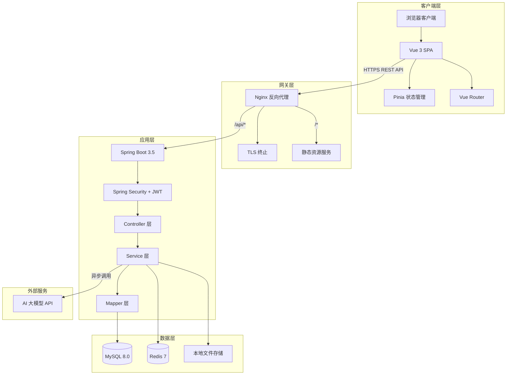
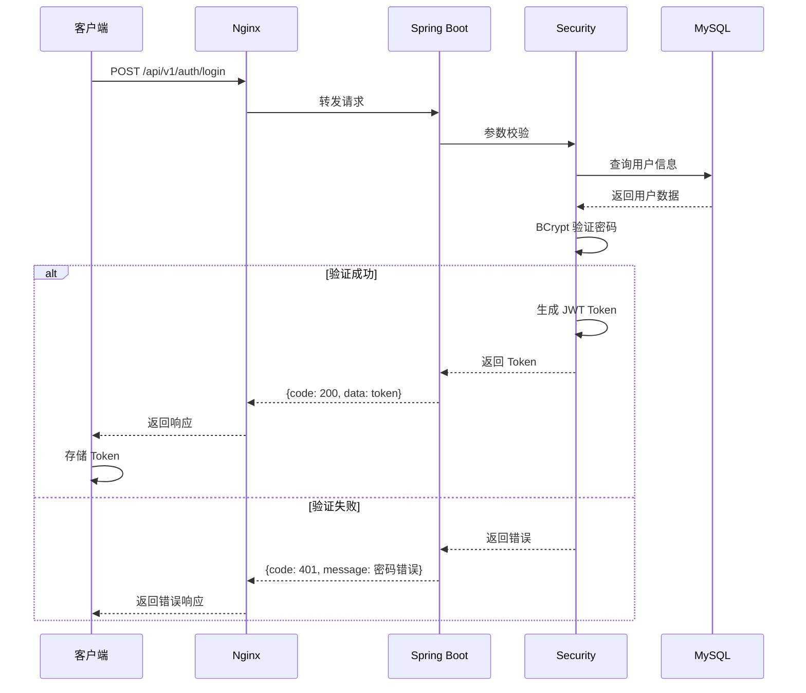
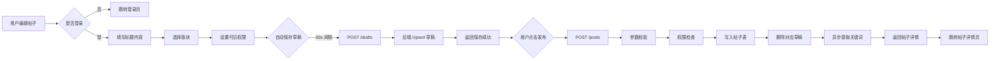
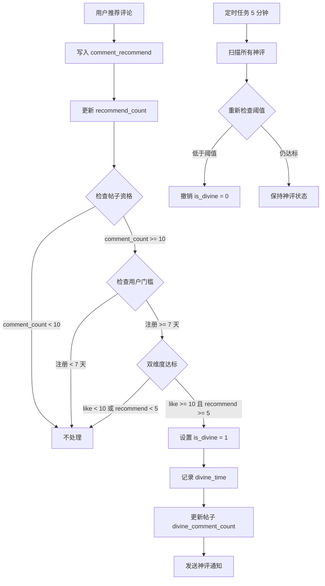
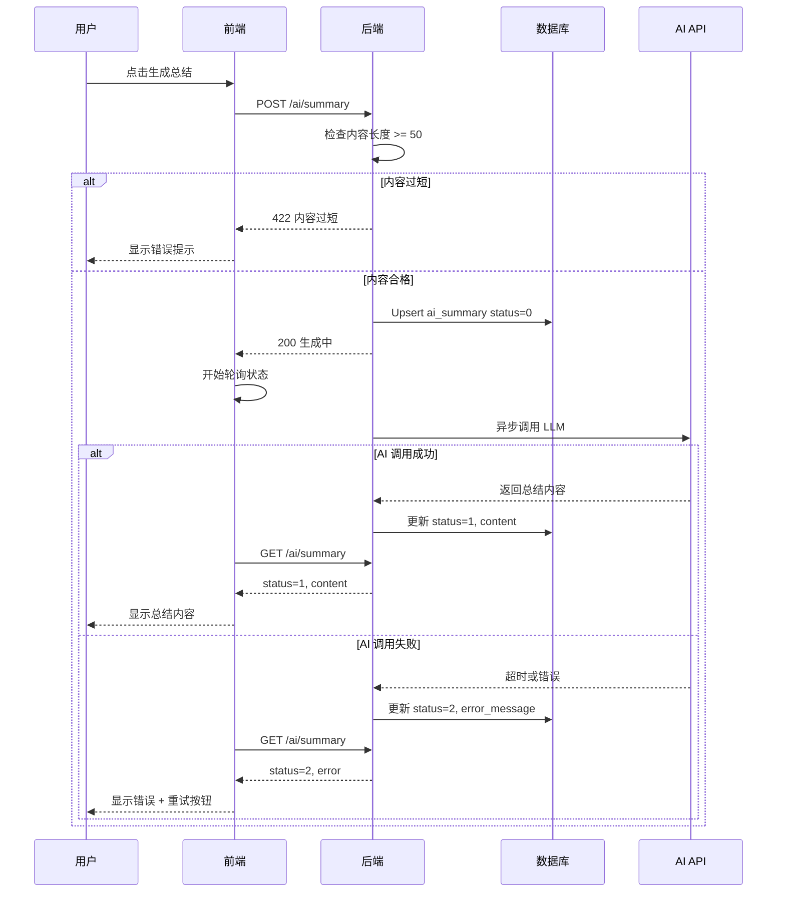
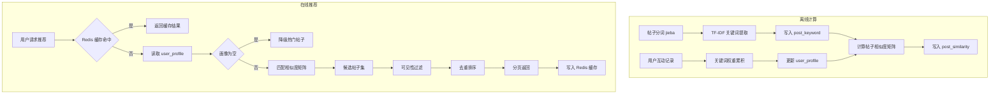
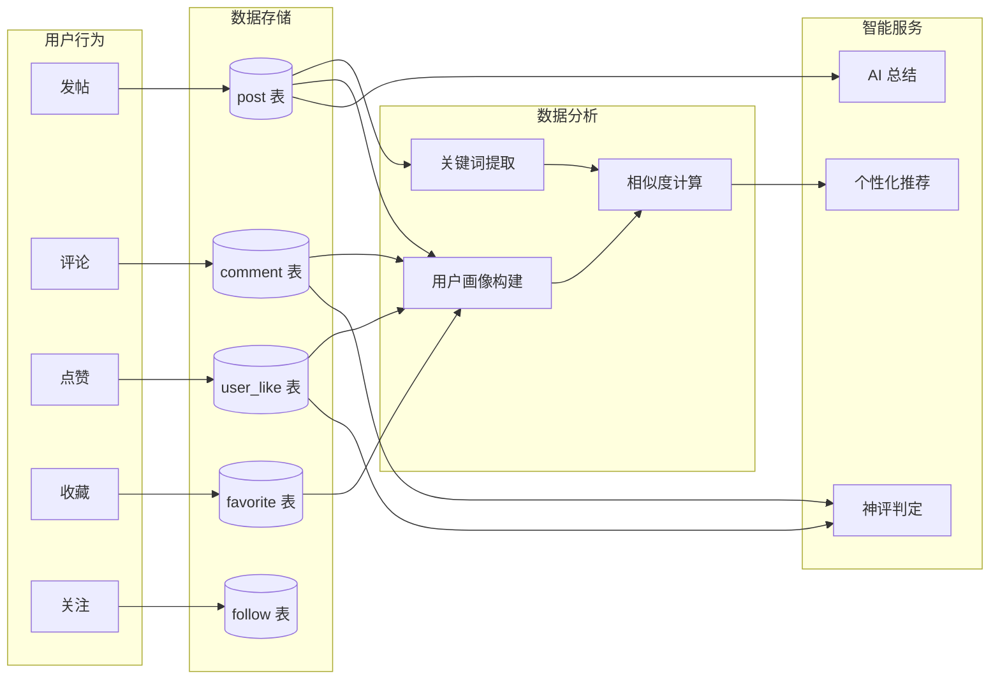
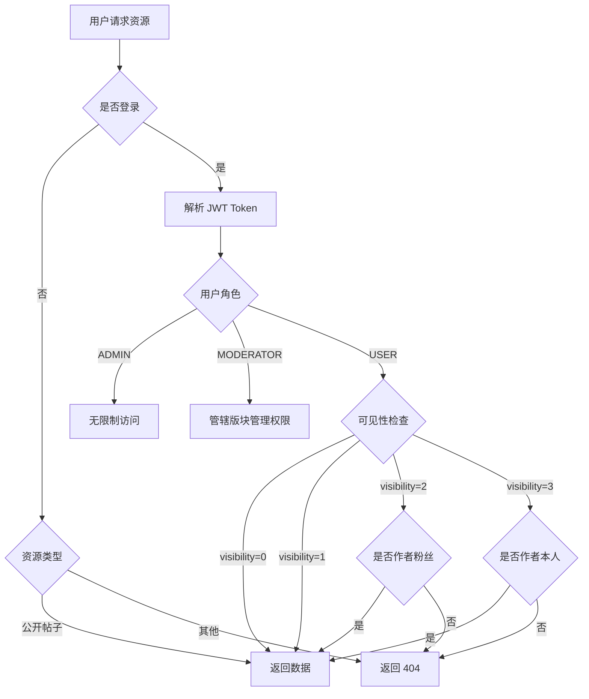

# TechHub 系统架构流程图

## 系统整体架构

```mermaid
graph TB
    subgraph 客户端层
        Browser[浏览器客户端]
        Vue3[Vue 3 SPA]
        Pinia[Pinia 状态管理]
        Router[Vue Router]
    end
    
    subgraph 网关层
        Nginx[Nginx 反向代理]
        TLS[TLS 终止]
        Static[静态资源服务]
    end
    
    subgraph 应用层
        SpringBoot[Spring Boot 3.5]
        Security[Spring Security + JWT]
        Controller[Controller 层]
        Service[Service 层]
        Mapper[Mapper 层]
    end
    
    subgraph 数据层
        MySQL[(MySQL 8.0)]
        Redis[(Redis 7)]
        FileStorage[本地文件存储]
    end
    
    subgraph 外部服务
        AIAPI[AI 大模型 API]
    end
    
    Browser --> Vue3
    Vue3 --> Pinia
    Vue3 --> Router
    Vue3 -->|HTTPS REST API| Nginx
    Nginx --> TLS
    Nginx -->|/api/*| SpringBoot
    Nginx -->|/*| Static
    SpringBoot --> Security
    Security --> Controller
    Controller --> Service
    Service --> Mapper
    Mapper --> MySQL
    Service --> Redis
    Service --> FileStorage
    Service -->|异步调用| AIAPI
```

## 用户认证流程

```mermaid
sequenceDiagram
    participant C as 客户端
    participant N as Nginx
    participant S as Spring Boot
    participant Sec as Security
    participant DB as MySQL
    
    C->>N: POST /api/v1/auth/login
    N->>S: 转发请求
    S->>Sec: 参数校验
    Sec->>DB: 查询用户信息
    DB-->>Sec: 返回用户数据
    Sec->>Sec: BCrypt 验证密码
    alt 验证成功
        Sec->>Sec: 生成 JWT Token
        Sec-->>S: 返回 Token
        S-->>N: {code: 200, data: token}
        N-->>C: 返回响应
        C->>C: 存储 Token
    else 验证失败
        Sec-->>S: 返回错误
        S-->>N: {code: 401, message: 密码错误}
        N-->>C: 返回错误响应
    end
```

## 帖子发布流程

```mermaid
graph LR
    A[用户编辑帖子] --> B{是否登录}
    B -->|否| C[跳转登录页]
    B -->|是| D[填写标题内容]
    D --> E[选择版块]
    E --> F[设置可见权限]
    F --> G{自动保存草稿}
    G -->|30s 间隔| H[POST /drafts]
    H --> I[后端 Upsert 草稿]
    I --> J[返回保存成功]
    J --> K{用户点击发布}
    K --> L[POST /posts]
    L --> M[参数校验]
    M --> N[权限检查]
    N --> O[写入帖子表]
    O --> P[删除对应草稿]
    P --> Q[异步提取关键词]
    Q --> R[返回帖子详情]
    R --> S[跳转帖子详情页]
```

## 神评判定流程

```mermaid
graph TD
    A[用户推荐评论] --> B[写入 comment_recommend]
    B --> C[更新 recommend_count]
    C --> D{检查帖子资格}
    D -->|comment_count < 10| E[不处理]
    D -->|comment_count >= 10| F{检查用户门槛}
    F -->|注册 < 7 天| E
    F -->|注册 >= 7 天| G{双维度达标}
    G -->|like < 10 或 recommend < 5| E
    G -->|like >= 10 且 recommend >= 5| H[设置 is_divine = 1]
    H --> I[记录 divine_time]
    I --> J[更新帖子 divine_comment_count]
    J --> K[发送神评通知]
    
    L[定时任务 5 分钟] --> M[扫描所有神评]
    M --> N{重新检查阈值}
    N -->|低于阈值| O[撤销 is_divine = 0]
    N -->|仍达标| P[保持神评状态]
```

## AI 总结流程

```mermaid
sequenceDiagram
    participant U as 用户
    participant F as 前端
    participant B as 后端
    participant DB as 数据库
    participant AI as AI API
    
    U->>F: 点击生成总结
    F->>B: POST /ai/summary
    B->>B: 检查内容长度 >= 50
    alt 内容过短
        B-->>F: 422 内容过短
        F-->>U: 显示错误提示
    else 内容合格
        B->>DB: Upsert ai_summary status=0
        B-->>F: 200 生成中
        F->>F: 开始轮询状态
        B->>AI: 异步调用 LLM
        alt AI 调用成功
            AI-->>B: 返回总结内容
            B->>DB: 更新 status=1, content
            F->>B: GET /ai/summary
            B-->>F: status=1, content
            F-->>U: 显示总结内容
        else AI 调用失败
            AI-->>B: 超时或错误
            B->>DB: 更新 status=2, error_message
            F->>B: GET /ai/summary
            B-->>F: status=2, error
            F-->>U: 显示错误 + 重试按钮
        end
    end
```

## 推荐系统流程

```mermaid
graph TB
    subgraph 离线计算
        A[帖子分词 jieba] --> B[TF-IDF 关键词提取]
        B --> C[写入 post_keyword]
        D[用户互动记录] --> E[关键词权重累积]
        E --> F[更新 user_profile]
        C --> G[计算帖子相似度矩阵]
        F --> G
        G --> H[写入 post_similarity]
    end
    
    subgraph 在线推荐
        I[用户请求推荐] --> J{Redis 缓存命中}
        J -->|是| K[返回缓存结果]
        J -->|否| L[读取 user_profile]
        L --> M{画像为空}
        M -->|是| N[降级热门帖子]
        M -->|否| O[匹配相似度矩阵]
        O --> P[候选帖子集]
        P --> Q[可见性过滤]
        Q --> R[去重排序]
        R --> S[分页返回]
        S --> T[写入 Redis 缓存]
    end
```

## 数据流向图

```mermaid
graph LR
    subgraph 用户行为
        U1[发帖]
        U2[评论]
        U3[点赞]
        U4[收藏]
        U5[关注]
    end
    
    subgraph 数据存储
        D1[(post 表)]
        D2[(comment 表)]
        D3[(user_like 表)]
        D4[(favorite 表)]
        D5[(follow 表)]
    end
    
    subgraph 数据分析
        A1[关键词提取]
        A2[用户画像构建]
        A3[相似度计算]
    end
    
    subgraph 智能服务
        S1[个性化推荐]
        S2[AI 总结]
        S3[神评判定]
    end
    
    U1 --> D1
    U2 --> D2
    U3 --> D3
    U4 --> D4
    U5 --> D5
    
    D1 --> A1
    D1 --> A2
    D2 --> A2
    D3 --> A2
    D4 --> A2
    
    A1 --> A3
    A2 --> A3
    
    A3 --> S1
    D1 --> S2
    D2 --> S3
    D3 --> S3
```

## 权限控制流程

```mermaid
graph TD
    A[用户请求资源] --> B{是否登录}
    B -->|否| C{资源类型}
    C -->|公开帖子| D[返回数据]
    C -->|其他| E[返回 404]
    B -->|是| F[解析 JWT Token]
    F --> G{用户角色}
    G -->|ADMIN| H[无限制访问]
    G -->|MODERATOR| I[管辖版块管理权限]
    G -->|USER| J{可见性检查}
    J -->|visibility=0| D
    J -->|visibility=1| D
    J -->|visibility=2| K{是否作者粉丝}
    K -->|是| D
    K -->|否| E
    J -->|visibility=3| L{是否作者本人}
    L -->|是| D
    L -->|否| E
```
